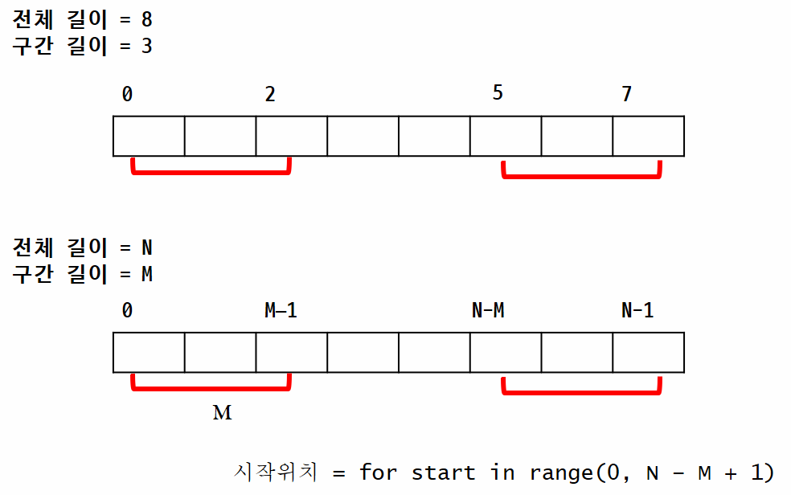
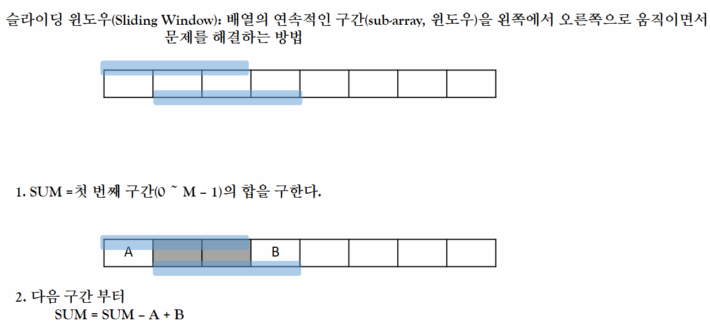
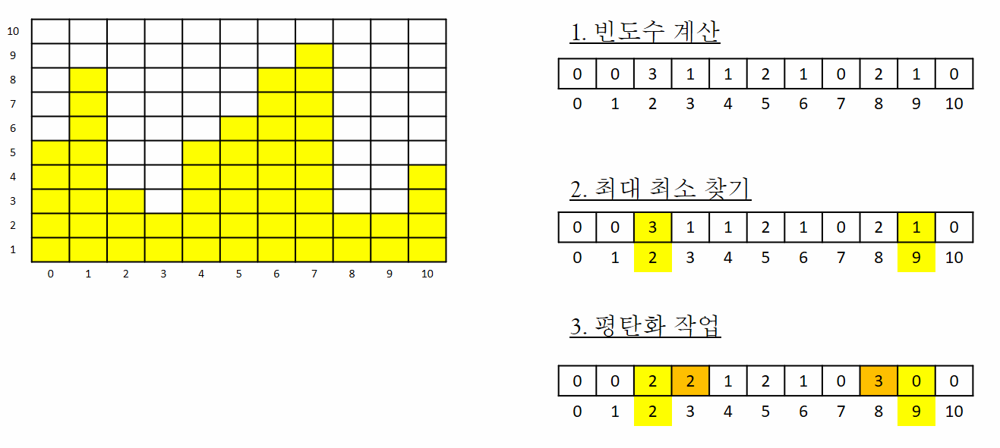
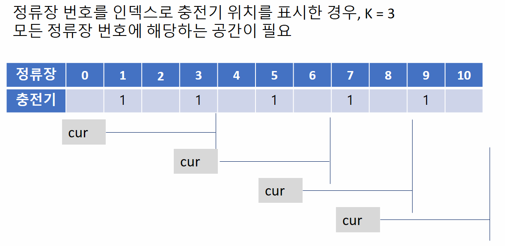
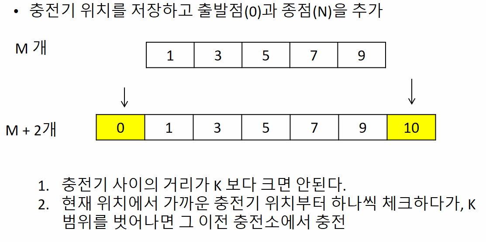

## 구간합

- 구간을 순회하기 위해서 필요한 정보
  
  - 시작 인덱스, 끝 인덱스
  
  - 또는, 시작 인덱스, 길이

- 조사할 모든 가능한 구간에 대해 완전 탐색

----------------

### 슬라이딩 윈도우 적용하기

-------

## Flatten

- 반복적으로 작성해야하는 코드는 **함수화** 하는 것도 고려

- 문제에서 제시되지 않는 극단적인 tc에 대해서 생각해본다.
  
  - 모든 같은 값, 점점 커지는 값, 점점 작아지는 값, 모두 음수, . . .

- 마지막으로 한번더 최대/최소를 찾는 작업이 필요하다.

### 방법 1 dump 횟수 반복하면서 최대/최소 위치 찾기
- 코드 참조

### 방법 2 카운팅 적용

## 전기 버스

### 방법 1

### 방법 2

