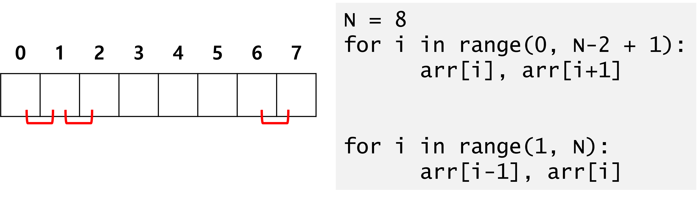
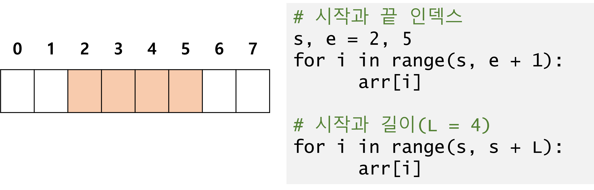
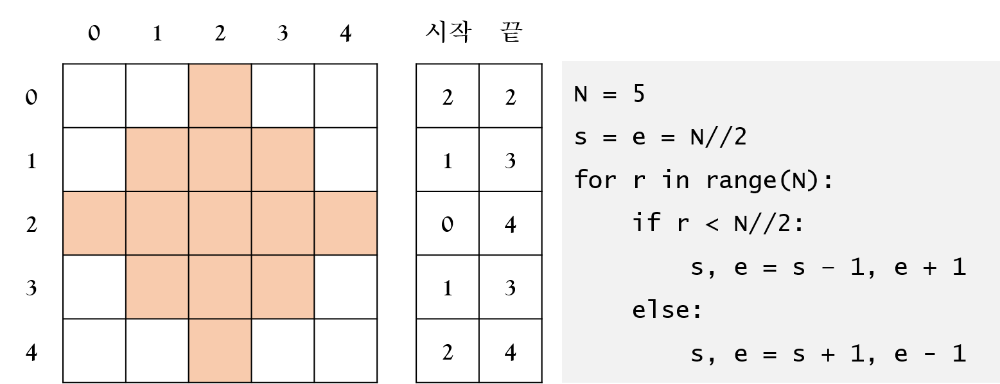
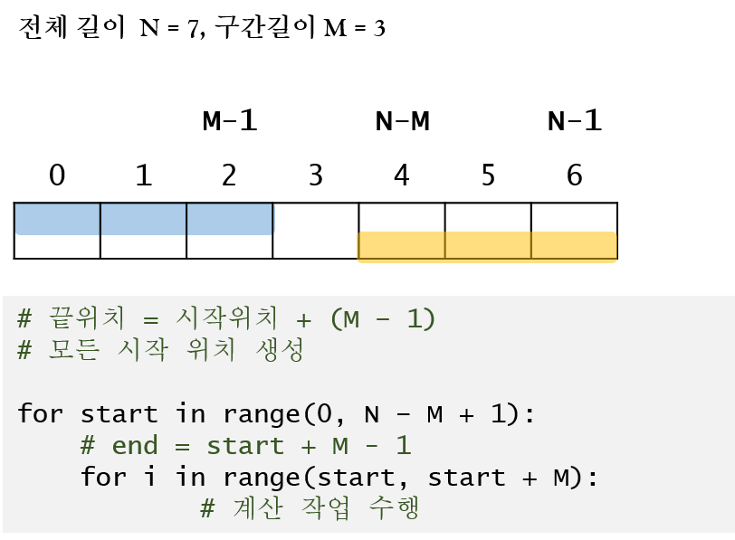
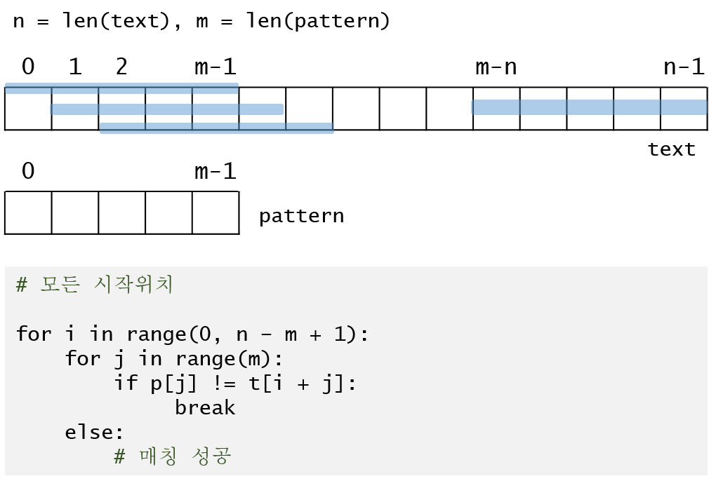
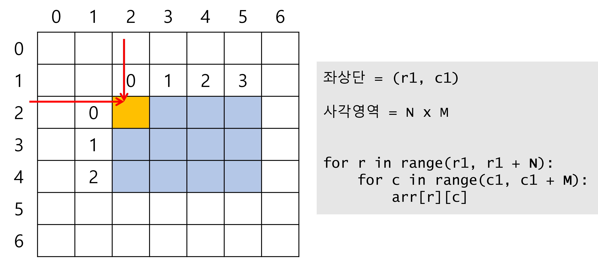

# 배열 구간

## 인접한 원소 처리하기

{width=75%}

## 1차 배열의 구간 표현

{width=75%}

## 구간 표현을 사용해서 패턴 파악

{width=75%}

## 가능한 모든 구간

{width=75%}

### 패턴 매칭에 적용

{width=75%}

-------------------------------

# 사각 영역

## 좌상단, 우하단

{width=75%}

## 좌상단, 높이, 너비

{width=75%}

-------------------------------

# 활용 문제

## Course -> Programming Intermediate
- 구간합(List1)
- 문자열 비교(string)  
- 색칠하기(List2)

- 2805.농작물 수확하기  
- 2001.파리퇴치
- 1974.스도쿠 검증
