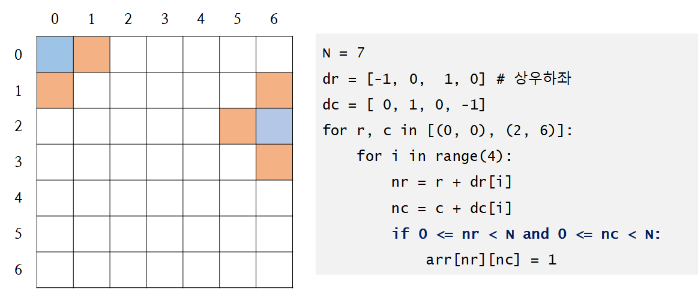
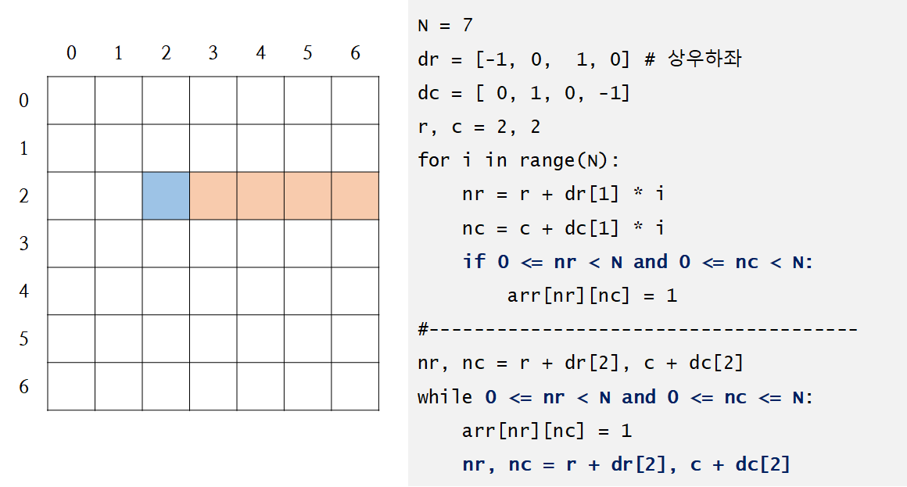
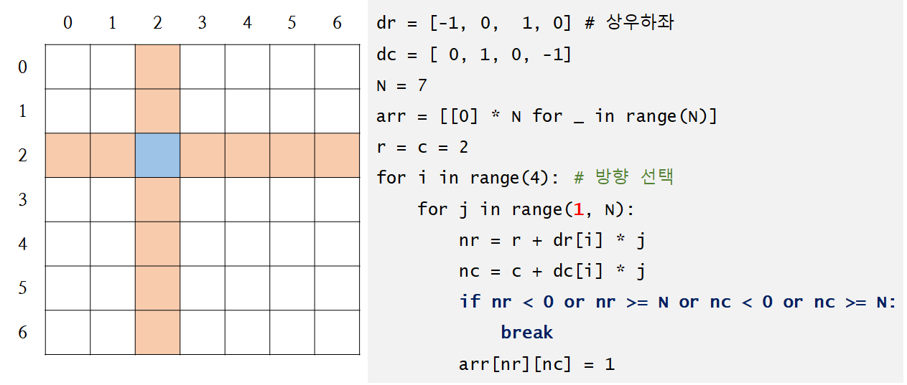
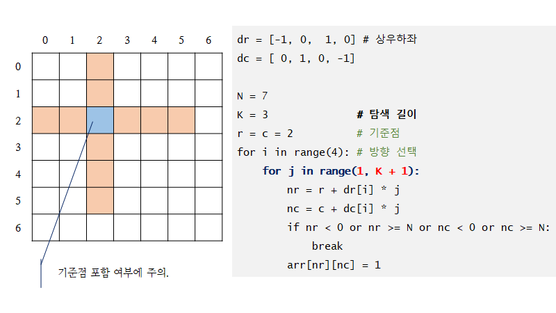

# 델타 활용

> **델타**

- 기준점에서 인접한 네 곳의 좌표를 생성하기

- **인덱스로 사용하기 전에 반드시 유효한 범위의 값인지 체크하자.**

> **직선 방향으로 연속해서 탐색**

> **반복문으로 네 방향 탐색**

> **필요한 거리만큼 탐색**

## 활용 문제

- 우주선착륙2(SWEA User problem 10760)
- 풍선팡(SWEA User problem 9490)
- 폭격 작전
- 오목 판정(SWEA 11315)
- 재미있는 오셀로 게임(0825_문제풀이3)

