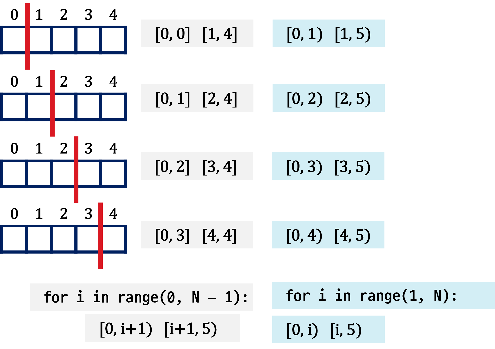
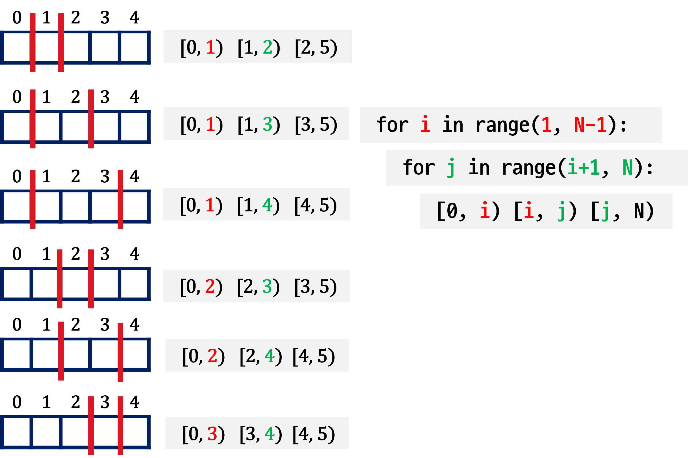
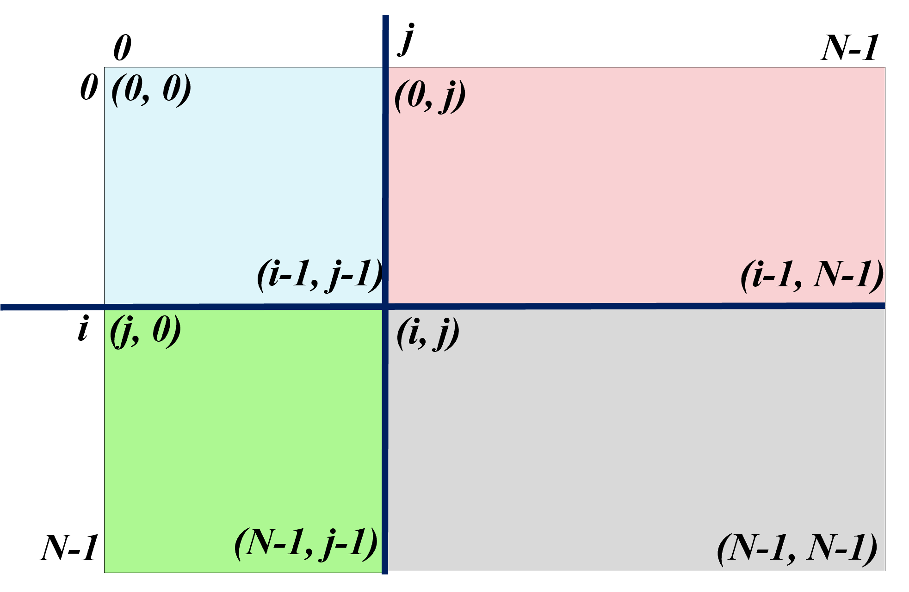

# N개에서 2개 선택(조합)
```python
lst = [1, 2, 3, 4]
N = len(lst)
for i in range(N-1):
    for j in range(i + 1, N):
        print(lst[i], lst[j])
```

# 배열 분할

## 1차 배열 2 분할

- 크기가 5인 배열을 2분할하는 방법은 **4(=N-1)** 가지이다.
- 분할하는 위치를 **첫번째 구간의 끝** 인덱스, 또는 **두번째 구간의 시작** 인덱스로 결정 

{width=75%}

## 1차 배열 3 분할

- 크기가 5인 배열을 3분할하는 방법은 **6(=4C2)** 가지이다.

{width=75%}

## 2차 배열 분할

- 2차 배열을 4개의 직사각 영역으로 분할
    - 1차 배열 2분할을 행과 열에 적용

{width=75%}


### 분할(조합) 활용 문제

- 3분할
- 농작물 수확
- 5948.새샘이의 7-3-5 게임
- 4163.러시아 국기 같은 깃발
